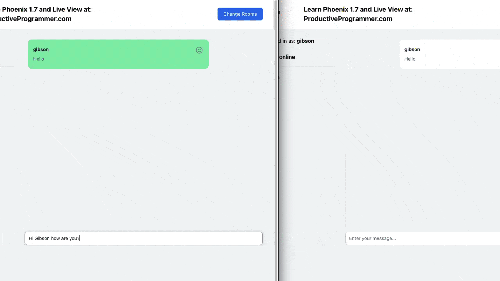

# Productive Programmer

## Phoenix 1.7 LiveView Chat App with TailwindCSS from ProductiveProgrammer.com

This is the finished version of my phoenix 1.7 liveview chat app that I built during my project 1 walkthrough of the full version of my paid phoenix liveview course at https://ProductiveProgrammer.com

If you want to see all of the code in progression with snapshots of the code as I built it step by step then that is available exclusively in the full version of my course. This is simply the finished version. Please note it only works with Phoenix 1.7 not prior versions of phoenix, again additional details in my course if needed at productiveprogrammer.com

For the full project walkthrough or to take my free phoenix liveView course head over to: https://ProductiveProgrammer.com

# Chat App

To start your Phoenix server:

  * Install dependencies with `mix deps.get`
  * Start Phoenix endpoint with `mix phx.server` or inside IEx with `iex -S mix phx.server`

Now you can visit [`localhost:4000`](http://localhost:4000) from your browser.

https://productiveprogrammer.com
